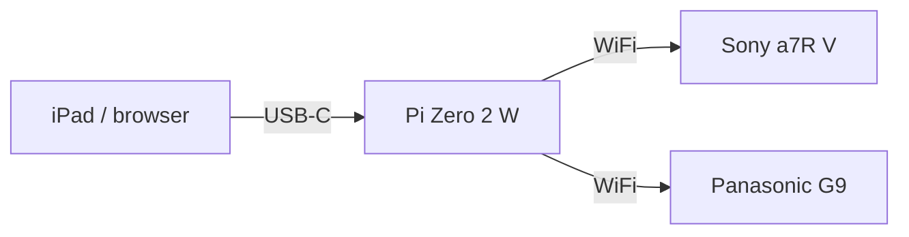

# cameralink

A Raspberry Pi Zero 2 W that bridges an iPad (or any browser) to a Sony or
Panasonic camera over Wi-Fi, so you can dial in film-emulation "recipes" —
Creative Look presets, Photo Style, White Balance, ISO — from a
phone-sized touchscreen instead of the camera's own menus, entirely
standalone in the field. No home network, no router, no internet
connection required anywhere in the chain.



A home page lets you pick which camera to control; each gets its own
page built around what that camera's control protocol actually supports
(see below — the two are not equally capable).

Full diagram and the reasoning behind it: [docs/ARCHITECTURE.md](docs/ARCHITECTURE.md).


## Why this exists

The obvious approach — a native app on a Mac talking to the camera over
USB — runs into a real, documented conflict: macOS has a system daemon
(`ptpcamerad`) that aggressively claims any camera plugged in over USB,
and it fights with anything else trying to talk to it, including Sony's
own official desktop software. Sony's Camera Remote SDK has an official
Linux build, and Linux has no such daemon. A Raspberry Pi Zero 2 W is
small and cheap enough to be the field-deployable "just run Linux"
answer — and its `dwc2` USB controller can run in **gadget mode**,
presenting itself as a USB-Ethernet device so it can be *powered and
controlled* by a single USB-C cable from an iPad, no separate battery.

More on this, and on why the camera connects over the Pi's own Wi-Fi
access point rather than USB: [docs/ARCHITECTURE.md](docs/ARCHITECTURE.md).

## What it can do

### Sony (a7R V, via Sony's Camera Remote SDK)

Everything here was verified against a physical Sony a7R V, not just
read from the SDK's documentation:

- Read and write **Creative Look** presets and all eight sub-parameters
  (Contrast, Highlights, Shadows, Fade, Saturation, Sharpness, Sharpness
  Range, Clarity)
- Read and write **White Balance** — mode, Tint, R-Gain/B-Gain, Kelvin
  color temperature, and Auto ISO, all exposed as live editable controls
  (not just readouts)
- Read and write **ISO**, including Auto
- Ships with **42 one-tap "push to camera" presets** across five groups:
  - **Film Recipe Chart** (7) — Kodak Portra 400/Ektar 100/Gold 200,
    Fujifilm Pro 400H, CineStill 800T, Ilford HP5 Plus, Fujicolor Superia
    X-TRA 400. Sourced from published film-stock technical data sheets;
    every field maps directly onto a real in-camera control.
  - **Film Stock Emulation** (5) and **Fujifilm Simulation** (9) — ported
    from a companion iPad photo-editing app's CoreImage-based color
    grades (same film stocks and Fuji simulations, different math). The
    source grades use per-channel curves and vignettes the camera has no
    equivalent for, so these are approximate translations of the closest
    available knobs (Contrast, Highlights, Shadows, Fade, Saturation,
    White Balance) — not exact reproductions. See [docs/PRESET_PACKS.md](docs/PRESET_PACKS.md).
  - **JP Presets — Daily Collection** (10) and **PS Presets** (11) —
    ported from the same companion app's Lightroom-preset emulations.
    These lean heavily on per-color-band HSL adjustments, tone curves,
    and split-toning that a camera JPEG engine simply doesn't expose;
    only the Basic-panel-equivalent sliders (contrast, highlights,
    shadows, a fade proxy, saturation) survive the translation. Treat
    these as loose stylistic nods, not faithful copies.

Full property-level detail, including the real (non-obvious) value ranges
the SDK doesn't document clearly: [docs/SDK_CAPABILITIES.md](docs/SDK_CAPABILITIES.md).

**What Sony can't do**: no SDK call can save the camera's live state into
a physical memory-recall slot (`C1`/`C2`/`C3`) — that's still a manual,
one-button step on the camera itself after pushing a recipe. See
[SDK_CAPABILITIES.md](docs/SDK_CAPABILITIES.md) for why.

### Panasonic (G9, via `cam.cgi`)

Panasonic has no accessible official Linux SDK — the Lumix Tether SDK is
Windows-only and gated behind camera-serial-number registration. The only
Linux-reachable path is `cam.cgi`, an unencrypted HTTP/CGI interface the
camera runs on its own IP, reverse-engineered by the community (no
Panasonic documentation exists for it). Confirmed working against a real
G9:

- Read and write **Photo Style** (Standard/Vivid/Natural/Monochrome
  variants/Cinelike/HLG/V-Log — 12 total)
- Read and write **White Balance** (16 named presets/color-temp slots)
- Read and write **ISO** (25 discrete steps, plus Auto and Intelligent ISO)
- Read and write the **Creative Control filter** (23 named effects)
- Ships with a **34-preset library** across two groups (Photo Style,
  Creative Control), each with a plain-English description

**What Panasonic can't do, that Sony can**: `cam.cgi` has **no continuous
sub-parameters at all** — confirmed by enumerating every one of the 34
commands the protocol supports. There's no remote Contrast, Sharpness,
Saturation, or Noise Reduction control within a Photo Style, and no
amber/blue or green/magenta White Balance fine-tune axis, even though the
G9's own on-camera menu has all of these. They just aren't wired up to
the network interface. (There's a second, richer path — Panasonic's own
PTP vendor extension, which does expose these plus full manual
exposure — but it's USB-only, and investigating it is still in progress;
see the Panasonic docs for details.) Practically: the Panasonic page is
preset/dropdown-driven, not slider-driven, because there's nothing to put
a slider on.

## Getting started

1. [docs/BUILDING.md](docs/BUILDING.md) — get Sony's CrSDK and build the server
2. [scripts/setup-pi.sh](scripts/setup-pi.sh) — one-time Pi network setup (USB gadget mode + Wi-Fi access point)
3. [docs/CAMERA_SETUP.md](docs/CAMERA_SETUP.md) — connect a Sony camera to the Pi's access point (Panasonic just needs to join the same Wi-Fi network by its normal Wi-Fi menu — DHCP-assigned or static both work — then enter its IP on the Panasonic page)

## API

The backend is a plain JSON REST API — the bundled web pages are just one
client of it. A native app would be a second client of the same
endpoints (this is the intended path for the iPad app — see Status below).

**Sony:**

| Endpoint | What it does |
|---|---|
| `GET /api/status` | Current connection state |
| `POST /api/connect/usb` | Connect to a camera over USB |
| `POST /api/connect/network` | Connect over Wi-Fi (`ip`, `mac`, `userId`, `password`) |
| `POST /api/disconnect` | Disconnect |
| `GET /api/recipe` | Read the camera's current live settings |
| `POST /api/recipe` | Write settings (any subset of fields) |
| `GET /api/presets` | The 42 built-in Sony presets, grouped |

**Panasonic:**

| Endpoint | What it does |
|---|---|
| `GET /api/panasonic/status` | Current connection state |
| `POST /api/panasonic/connect` | Connect over Wi-Fi (`ip`) |
| `POST /api/panasonic/disconnect` | Disconnect |
| `GET /api/panasonic/recipe` | Read the camera's current live settings |
| `POST /api/panasonic/recipe` | Write settings (`photoStyle`/`whiteBalance`/`iso`/`filterEffect`, any subset) |
| `GET /api/panasonic/presets` | The 34 built-in Panasonic presets, grouped |

**Pi system control:**

| Endpoint | What it does |
|---|---|
| `POST /api/system/shutdown` | Cleanly power off the Pi (confirmed under 20 seconds end-to-end) |

## Project layout

```
server/       C++ backend (cpp-httplib) + the bundled web frontend
third_party/  Vendored MIT-licensed httplib.h; Sony's CrSDK goes here (gitignored, see docs/BUILDING.md)
scripts/      Build script, one-time Pi network setup script
docs/         Architecture, SDK capability notes, setup guides
```

## Status

Working end-to-end on real hardware: a Raspberry Pi Zero 2 W running as
its own Wi-Fi access point, both a Sony a7R V and a Panasonic G9
connected over that network (the AP hands out DHCP so either camera can
join, static or not), and this server's web UI reachable over a USB-C
cable from a Mac or iPad. Camera ↔ Pi connectivity and Pi ↔ USB-host
connectivity have both been validated with extended stability testing
(not just a one-off connection). The full Sony Creative Look + White
Balance + ISO field set, and the full Panasonic Photo Style + White
Balance + ISO + Creative Control field set, have each been confirmed to
apply correctly end-to-end against real hardware.

The Pi runs the server as a `systemd` service (`cameralink.service`) that
survives reboots and crashes automatically — confirmed via two real
power cycles — and the web UI has a one-tap clean shutdown button
(`POST /api/system/shutdown`) so the Pi doesn't need its power cable
yanked to turn off.

**The big remaining piece is a native iPad app** — the REST API above was
deliberately built client-agnostic for exactly this. No iPad app work has
started yet beyond an unrelated throwaway diagnostic tool used to probe
whether iOS's MFi restrictions would block a *direct* USB connection to
the Panasonic (inconclusive so far; see the Panasonic docs). Also not yet
built: Picture Profile's deeper sub-parameters on Sony beyond the slot
selector, and — pending a hardware/USB-topology decision — Panasonic's
richer PTP vendor-extension protocol (full manual exposure, White
Balance fine-tune), which needs a different Pi USB arrangement than the
current one to pursue.

## License

[GPLv3](LICENSE).

## A note on how this was built

This project — architecture, debugging, and code — was built through an
extended pair-programming session with Claude (Anthropic). Bugs found and
fixed along the way (a use-after-free crash, an off-by-one in a
preset-slot encoding, a NetworkManager autoconnect-priority bug, and a
DHCP-retry-loop causing USB instability) are documented in the relevant
docs above, warts and all, rather than cleaned up after the fact.

Chuck vibecoded the hell out of it :-)
