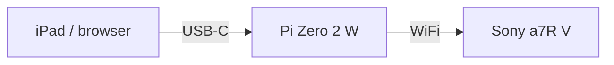
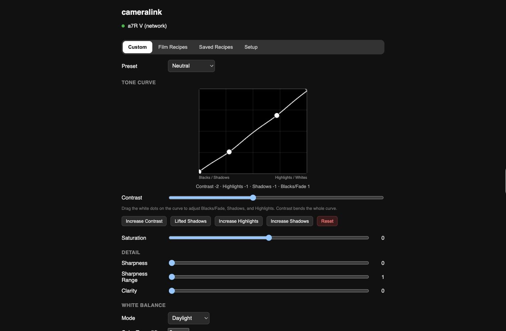
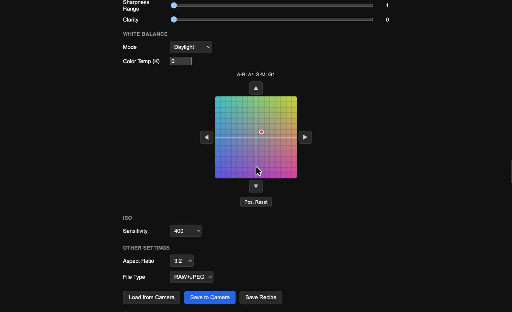

# cameralink

A Raspberry Pi Zero 2 W that bridges an iPad, phone, or any browser to a
Sony camera over Wi-Fi, so you can dial in film-emulation "recipes" —
Creative Look presets, White Balance, ISO, and more — from a phone-sized
touchscreen instead of the camera's own menus, entirely standalone in the
field. No home network, no router, no internet connection required
anywhere in the chain.



Full diagram and the reasoning behind it: [docs/ARCHITECTURE.md](docs/ARCHITECTURE.md).

**The Pi Zero 2 W + iPad combo above is the field-deployable design
target** — the smallest, cheapest, most self-contained rig that needs
nothing but a single USB-C cable and no network infrastructure at all.
But nothing about the server itself is Pi-specific: it's one C++ binary
with no dependency on USB gadget mode or a Wi-Fi access point. It runs
identically on any Linux machine (a laptop, a NUC, a VM) that can reach
the camera over a network — point a browser at it directly, no iPad in
the loop at all. The Pi/iPad pieces are for the specific "field kit,
no infrastructure" use case; [docs/INSTALL.md](docs/INSTALL.md) is about
finding out exactly how little else the server itself actually needs.


## Why this exists

The obvious approach — a native app on a Mac talking to the camera over
USB — runs into a real, documented conflict: macOS has a system daemon
(`ptpcamerad`) that aggressively claims any camera plugged in over USB,
and it fights with anything else trying to talk to it, including Sony's
own official desktop software. Sony's Camera Remote SDK has an official
Linux build, and Linux has no such daemon. A Raspberry Pi Zero 2 W is
small and cheap enough to be the field-deployable "just run Linux"
answer — and its `dwc2` USB controller can run in **gadget mode**,
presenting itself as a USB-Ethernet device so it can be *powered and
controlled* by a single USB-C cable from an iPad, no separate battery.

More on this, and on why the camera connects over the Pi's own Wi-Fi
access point rather than USB: [docs/ARCHITECTURE.md](docs/ARCHITECTURE.md).

## What it can do

Everything here was verified against a physical Sony a7R V (ILCE-7RM5),
not just read from the SDK's documentation — this project's whole
development style was "confirm on real hardware before believing the
header comments," because several properties that *look* correct in the
SDK's own headers turned out to be dead on this camera (see
[docs/SDK_CAPABILITIES.md](docs/SDK_CAPABILITIES.md) for the specifics
and how each one was actually confirmed).

- **Creative Look** — preset selector (`ST`/`PT`/`NT`/`VV`/`VV2`/`FL`/
  `IN`/`SH`/`BW`/`SE`, plus the camera's 6 user Custom slots `CS1`–`CS6`)
  and all eight numeric sub-parameters: Contrast, Highlights, Shadows,
  Fade, Saturation, Sharpness, Sharpness Range, Clarity. A visual,
  draggable **Tone Curve** widget drives Contrast/Highlights/Shadows/Fade
  together instead of four separate sliders.

  

- **White Balance** — mode (AWB, Daylight, Shade, Cloudy, Tungsten,
  Fluorescent, Flash, Color Temp, Custom), a real Kelvin color-temperature
  control, and a 15×15 **Color Filter (A-B / G-M)** grid picker that
  matches the camera's own on-screen fine-tune grid pixel-for-pixel.

  

- **ISO**, including Auto.
- **Aspect Ratio, File Type** (RAW / RAW+JPEG / JPEG) — confirmed
  read/write against the real camera.
- **Camera/Lens/Memory info panel** — model, serial, firmware version,
  battery level and percentage, lens model + firmware version, and
  remaining-shots count for both media slots.
- **Saved Recipes** — a 10-slot, user-managed recipe library (separate
  from the built-in Film Recipe Chart presets below) with full create /
  read / update / rename / delete. The Custom tab is an explicit
  load/edit/save workflow rather than pushing every slider drag straight
  to the camera: **Load from Camera** pulls the camera's current live
  state into the form, you tweak freely with zero camera traffic, then
  **Save to Camera** commits the whole form in one write — or **Save
  Recipe** stores it into a library slot instead, for later one-tap
  recall.
- **Film Recipe Chart** (8 built-in presets) — Kodak Portra 400, Ektar
  100, Gold 200; Fujifilm Pro 400H, Superia X-TRA 400; CineStill 800T;
  Ilford HP5 Plus; Vision3 500T. Sourced from published film-stock
  technical data sheets; every field maps directly onto a real in-camera
  control (not an approximation). Four earlier preset packs that
  attempted to port a Lightroom/CoreImage-based photo-editing app's color
  grades onto the camera's much smaller Creative Look control surface
  were tried and then removed — see
  [docs/PRESET_PACKS.md](docs/PRESET_PACKS.md) for why, and why Saved
  Recipes replaced them instead.
- **One-tap clean shutdown** for the Pi from the web UI (confirmed under
  20 seconds end-to-end), and a "Quick Connect" one-tap camera reconnect
  that remembers a camera's IP/MAC/credentials (`saved_cameras.json`,
  gitignored, never committed).

Full property-level detail, including the real (non-obvious) value ranges
and data types the SDK doesn't document clearly, and a list of properties
that *look* real in the headers but aren't actually present on this
camera: [docs/SDK_CAPABILITIES.md](docs/SDK_CAPABILITIES.md).

**What it can't do**: no SDK call can save the camera's live state into a
physical memory-recall slot (`C1`/`C2`/`C3`) — that's still a manual,
one-button step on the camera itself after pushing a recipe. See
[SDK_CAPABILITIES.md](docs/SDK_CAPABILITIES.md) for why.

A Panasonic G9 integration was prototyped and then removed: Panasonic has
no accessible official Linux SDK, and the only Linux-reachable path
(`cam.cgi`, an unencrypted, community-reverse-engineered HTTP/CGI
interface) turned out to have no continuous sub-parameters at all —
confirmed by enumerating every one of the 34 commands the protocol
supports. No remote Contrast/Sharpness/Saturation/Noise Reduction, no
White Balance fine-tune axis — just named presets, not enough capability
to be worth the extra surface area. Not pursuing it further.

## Getting started

1. [docs/BUILDING.md](docs/BUILDING.md) — get Sony's CrSDK and build the server
2. [scripts/setup-pi.sh](scripts/setup-pi.sh) — one-time Pi network setup (USB gadget mode + Wi-Fi access point) — Pi-specific, skip on a generic Linux box
3. [docs/CAMERA_SETUP.md](docs/CAMERA_SETUP.md) — connect the camera to the Pi's access point

Setting this up on a fresh machine from scratch (including handing the
job to an AI coding assistant): [docs/INSTALL.md](docs/INSTALL.md).

## What the server needs to run

There is **no separate web server** (no nginx, no Apache) — `main.cpp`
is a single self-contained C++ binary that serves both the JSON API and
the static frontend itself, via the bundled
[cpp-httplib](https://github.com/yhirose/cpp-httplib) (`third_party/httplib.h`,
vendored, MIT-licensed). The only two things a target machine needs are:

- **A C++17 toolchain** (`g++`, `build-essential` on Debian/Raspberry Pi OS) to compile it.
- **Sony's CrSDK runtime** (`libCr_Core.so` + its `CrAdapter/` plugin
  libraries) — proprietary, not redistributable, fetched separately per
  [docs/BUILDING.md](docs/BUILDING.md).

Everything else (Wi-Fi access point, USB gadget mode) is specific to the
**field-deployable Pi Zero 2 W setup**, not a requirement of the server
itself — the same binary runs fine on any Linux x86_64/arm64 box that has
a matching CrSDK build and can reach the camera over a network (even a
plain Ethernet LAN the camera and the server both sit on). That's exactly
what [docs/INSTALL.md](docs/INSTALL.md) is for: standing up just the
server on a bare Linux machine to see how much of this is really
Pi-specific.

## API

The backend is a plain JSON REST API — the bundled web page
(`server/public/index.html`) is just one client of it. A native app would
be a second client of the same endpoints (this is the intended path for
the iPad app — see Status below).

| Endpoint | What it does |
|---|---|
| `GET /api/status` | Current connection state |
| `GET /api/camera-info` | Model, serial, firmware, battery, lens, media slot remaining shots |
| `POST /api/connect/usb` | Connect to a camera over USB |
| `POST /api/connect/network` | Connect over Wi-Fi (`ip`, `mac`, `userId`, `password`) |
| `POST /api/disconnect` | Disconnect |
| `GET /api/recipe` | Read the camera's current live settings |
| `POST /api/recipe` | Write settings (any subset of fields) |
| `GET /api/presets` | The 8 built-in Film Recipe Chart presets, grouped |
| `GET /api/recipes/saved` | List the 10-slot Saved Recipes library |
| `POST /api/recipes/save` | Create (auto-assigns a free slot) or update (pass `slot`) a saved recipe |
| `POST /api/recipes/rename` | Rename a saved recipe slot |
| `POST /api/recipes/delete` | Delete a saved recipe slot |
| `GET /api/network/saved` | List saved "Quick Connect" camera profiles |
| `POST /api/network/save` | Save/update a Quick Connect camera profile |
| `GET /api/network/find` | Look up a camera's DHCP-leased IP by MAC address |
| `GET /api/debug/allprops` | Dump every property the SDK exposes for the connected camera, with human-readable names — the standing diagnostic tool used to discover which properties actually exist/work on this body |
| `POST /api/system/shutdown` | Cleanly power off the Pi (confirmed under 20 seconds end-to-end) |

## Project layout

```
server/       C++ backend (cpp-httplib) + the bundled web frontend
third_party/  Vendored MIT-licensed httplib.h; Sony's CrSDK goes here (gitignored, see docs/BUILDING.md)
scripts/      Build script, systemd unit template, one-time Pi network setup script
docs/         Architecture, SDK capability notes, setup guides, fresh-machine install guide
```

## Lines of code

```
server/main.cpp             1,311   (backend: SDK integration, REST API, JSON)
server/public/index.html    1,110   (frontend: HTML/CSS/JS, single file)
-----------------------------------
Total authored code         2,421
```

Plus 675 lines of `LICENSE` (GPLv3, standard boilerplate) and
`third_party/httplib.h` (10,393 lines, vendored MIT-licensed dependency,
not authored by this project). Sony's own `CrDebugString.cpp`/`.h`
(~120KB) are not tracked in git at all — they're part of the proprietary
CrSDK download, gitignored under `third_party/CrSDK/` along with the rest
of the SDK.

## Status

Working end-to-end on real hardware: a Raspberry Pi Zero 2 W running as
its own Wi-Fi access point, a Sony a7R V connected over that network with
a static IP, and this server's web UI reachable over a USB-C cable from a
Mac or iPad. Camera ↔ Pi connectivity and Pi ↔ USB-host connectivity have
both been validated with extended stability testing (not just a one-off
connection), and the full field set documented above has been confirmed
to read and write correctly end-to-end against the physical camera,
including the Saved Recipes CRUD flow and the Film Recipe Chart presets.

The Pi runs the server as a `systemd` service (`cameralink.service`, see
[scripts/cameralink.service](scripts/cameralink.service)) that survives
reboots and crashes automatically — confirmed via real power cycles — and
the web UI has a one-tap clean shutdown button
(`POST /api/system/shutdown`) so the Pi doesn't need its power cable
yanked to turn off.

**The big remaining piece is a native iPad app** — the REST API above was
deliberately built client-agnostic for exactly this. Also not yet built:
Picture Profile's deeper sub-parameters beyond the slot selector. Next up:
validating how much of the install process (beyond the manual,
un-automatable step of accepting Sony's SDK license) can be handed to an
AI coding assistant on a completely bare Linux machine — see
[docs/INSTALL.md](docs/INSTALL.md).

## License

[GPLv3](LICENSE).

## A note on how this was built

This project — architecture, debugging, and code — was built through an
extended pair-programming session with Claude (Anthropic). Bugs found and
fixed along the way (a use-after-free crash, an off-by-one in a
preset-slot encoding, a NetworkManager autoconnect-priority bug, a
DHCP-retry-loop causing USB instability, a string-decoding bug that
dropped the first character of every device string, and properties that
looked real in the SDK headers but turned out not to exist on this
camera at all) are documented in the relevant docs above, warts and all,
rather than cleaned up after the fact.

Chuck vibecoded the hell out of it :-)
