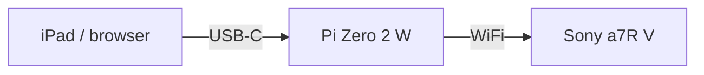
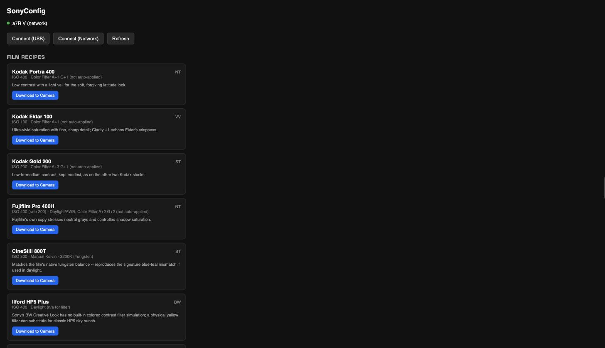

# cameralink

A Raspberry Pi Zero 2 W that bridges an iPad (or any browser) to a Sony
camera over Wi-Fi, so you can dial in film-emulation "recipes" — Creative
Look presets, White Balance, ISO — from a phone-sized touchscreen instead
of the camera's own menus, entirely standalone in the field. No home
network, no router, no internet connection required anywhere in the chain.



Full diagram and the reasoning behind it: [docs/ARCHITECTURE.md](docs/ARCHITECTURE.md).



## Why this exists

The obvious approach — a native app on a Mac talking to the camera over
USB — runs into a real, documented conflict: macOS has a system daemon
(`ptpcamerad`) that aggressively claims any camera plugged in over USB,
and it fights with anything else trying to talk to it, including Sony's
own official desktop software. Sony's Camera Remote SDK has an official
Linux build, and Linux has no such daemon. A Raspberry Pi Zero 2 W is
small and cheap enough to be the field-deployable "just run Linux"
answer — and its `dwc2` USB controller can run in **gadget mode**,
presenting itself as a USB-Ethernet device so it can be *powered and
controlled* by a single USB-C cable from an iPad, no separate battery.

More on this, and on why the camera connects over the Pi's own Wi-Fi
access point rather than USB: [docs/ARCHITECTURE.md](docs/ARCHITECTURE.md).

## What it can do

Everything here was verified against a physical Sony a7R V, not just
read from the SDK's documentation:

- Read and write **Creative Look** presets and all eight sub-parameters
  (Contrast, Highlights, Shadows, Fade, Saturation, Sharpness, Sharpness
  Range, Clarity)
- Read and write **White Balance** (mode, Tint, R/B Gain, Kelvin color
  temperature)
- Read and write **ISO**
- Ships with **42 one-tap "push to camera" presets** across five groups:
  - **Film Recipe Chart** (7) — Kodak Portra 400/Ektar 100/Gold 200,
    Fujifilm Pro 400H, CineStill 800T, Ilford HP5 Plus, Fujicolor Superia
    X-TRA 400. Sourced from published film-stock technical data sheets;
    every field maps directly onto a real in-camera control.
  - **Film Stock Emulation** (5) and **Fujifilm Simulation** (9) — ported
    from a companion iPad photo-editing app's CoreImage-based color
    grades (same film stocks and Fuji simulations, different math). The
    source grades use per-channel curves and vignettes the camera has no
    equivalent for, so these are approximate translations of the closest
    available knobs (Contrast, Highlights, Shadows, Fade, Saturation,
    White Balance) — not exact reproductions. See [docs/PRESET_PACKS.md](docs/PRESET_PACKS.md).
  - **JP Presets — Daily Collection** (10) and **PS Presets** (11) —
    ported from the same companion app's Lightroom-preset emulations.
    These lean heavily on per-color-band HSL adjustments, tone curves,
    and split-toning that a camera JPEG engine simply doesn't expose;
    only the Basic-panel-equivalent sliders (contrast, highlights,
    shadows, a fade proxy, saturation) survive the translation. Treat
    these as loose stylistic nods, not faithful copies.

Full property-level detail, including the real (non-obvious) value ranges
the SDK doesn't document clearly: [docs/SDK_CAPABILITIES.md](docs/SDK_CAPABILITIES.md).

**What it can't do**: no Sony SDK call can save the camera's live state
into a physical memory-recall slot (`C1`/`C2`/`C3`) — that's still a
manual, one-button step on the camera itself after pushing a recipe. See
[SDK_CAPABILITIES.md](docs/SDK_CAPABILITIES.md) for why.

## Getting started

1. [docs/BUILDING.md](docs/BUILDING.md) — get Sony's CrSDK and build the server
2. [scripts/setup-pi.sh](scripts/setup-pi.sh) — one-time Pi network setup (USB gadget mode + Wi-Fi access point)
3. [docs/CAMERA_SETUP.md](docs/CAMERA_SETUP.md) — connect the camera to the Pi's access point

## API

The backend is a plain JSON REST API — the bundled web page
(`server/public/index.html`) is just one client of it. A native app would
be a second client of the same endpoints.

| Endpoint | What it does |
|---|---|
| `GET /api/status` | Current connection state |
| `POST /api/connect/usb` | Connect to a camera over USB |
| `POST /api/connect/network` | Connect over Wi-Fi (`ip`, `mac`, `userId`, `password`) |
| `POST /api/disconnect` | Disconnect |
| `GET /api/recipe` | Read the camera's current live settings |
| `POST /api/recipe` | Write settings (any subset of fields) |
| `GET /api/presets` | The 42 built-in presets, grouped |

## Project layout

```
server/       C++ backend (cpp-httplib) + the bundled web frontend
third_party/  Vendored MIT-licensed httplib.h; Sony's CrSDK goes here (gitignored, see docs/BUILDING.md)
scripts/      Build script, one-time Pi network setup script
docs/         Architecture, SDK capability notes, setup guides
```

## Status

Working end-to-end on real hardware: a Raspberry Pi Zero 2 W running as
its own Wi-Fi access point, a Sony a7R V connected over that network with
a static IP, and this server's web UI reachable over a USB-C cable from a
Mac. Camera → Pi connectivity and Pi → USB-host connectivity have both
been validated with extended stability testing (not just a one-off
connection), and the full Creative Look + White Balance + ISO field set
has been confirmed to apply correctly end-to-end, including representative
presets from all five groups.

Not yet built: a native iPad app (the API is designed for this, see
above), and Picture Profile's deeper sub-parameters beyond the slot
selector.

## License

[GPLv3](LICENSE).

## A note on how this was built

This project — architecture, debugging, and code — was built through an
extended pair-programming session with Claude (Anthropic). Bugs found and
fixed along the way (a use-after-free crash, an off-by-one in a
preset-slot encoding, a NetworkManager autoconnect-priority bug, and a
DHCP-retry-loop causing USB instability) are documented in the relevant
docs above, warts and all, rather than cleaned up after the fact.

Chuck vibecoded the hell out of it :-)
