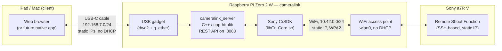

# Architecture

## System diagram

Two independent links, both deliberately **static-addressed with no DHCP**:

- **iPad/Mac ↔ Pi, over USB.** The Pi presents itself as a USB Ethernet
  device (`g_ether`) when its USB port is plugged into the iPad or a Mac.
  This is also how the Pi gets its power in the field — one cable does both.
- **Pi ↔ camera, over WiFi.** The Pi runs its *own* access point; the
  camera joins it directly. No home network, no router, no internet
  connection required anywhere in this chain — the whole rig works
  standalone, anywhere.

## Why a Raspberry Pi Zero 2 W

The obvious first approach — a native macOS app calling Sony's CrSDK
directly — doesn't work reliably. macOS runs a system daemon
(`ptpcamerad`) that aggressively claims any PTP-class USB camera for
Photos/Image Capture the moment it's plugged in, and it respawns within
milliseconds of being killed. This isn't a corner case bug — it's a
documented, long-standing conflict between macOS and *any* third-party
camera-tethering software, including Sony's own official Imaging Edge
Desktop.

Sony's CrSDK ships an official Linux build, and Linux has no equivalent
daemon fighting for the USB interface. A Raspberry Pi is small, cheap,
runs that Linux build natively, and — critically for a Zero 2 W
specifically — its USB controller (`dwc2`) supports **USB gadget mode**:
it can present itself as a device (a USB Ethernet adapter) rather than a
host, which is exactly what's needed to be powered by *and* controlled
from an iPad over a single cable, no adapter, no separate battery.

The Zero 2 W's single radio can't do USB-host and Wi-Fi-client duty at the
same time in the way this project needs anyway — but that turns out not to
matter, because the camera doesn't connect over USB at all in this
architecture. It connects over the Pi's own Wi-Fi access point. USB is
reserved entirely for the iPad link.

## No DHCP on the access point

Early revisions of the Pi's access point used NetworkManager's default
"shared" mode, which bundles a `dnsmasq` DHCP server automatically. This
was removed deliberately, for two reasons:

1. **The camera's IP never needs to change.** cameralink already treats
   the camera's address as a fixed value you provide when connecting — a
   dynamically-assigned address adds a moving part for no benefit.
2. **It was implicated in a real stability bug.** The Pi's own USB gadget
   interface (`usb0`) was left on its default DHCP-seeking configuration,
   endlessly retrying a lease over a link where nothing serves DHCP. That
   retry loop is a documented cause of exactly the kind of intermittent
   USB gadget flakiness this project hit early on. The fix was static IPs
   end-to-end: `usb0` and the camera's Wi-Fi interface are both manually
   configured (see [CAMERA_SETUP.md](CAMERA_SETUP.md)), and the AP itself
   runs with `ipv4.method: manual` instead of `shared` — no `dnsmasq`
   process at all.

## API-first design

`server/main.cpp` exposes a plain JSON REST API
(`/api/status`, `/api/connect/usb`, `/api/connect/network`, `/api/recipe`,
`/api/presets`, `/api/disconnect`); `server/public/index.html` is just one
client of it, calling the same endpoints with `fetch()`. A future native
iPad app would be a second client of the identical API — the backend
doesn't need to change to support that.

## A note on macOS

An earlier phase of this project built a native macOS app calling CrSDK
directly, before the `ptpcamerad` conflict above made that path
unreliable enough to abandon in favor of the Pi. That code isn't part of
this repo (see [README.md](../README.md) for scope), but the finding is
worth recording here since it's the reason this project exists in its
current shape.
