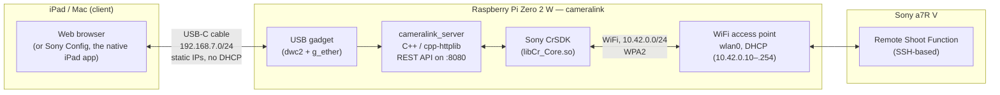
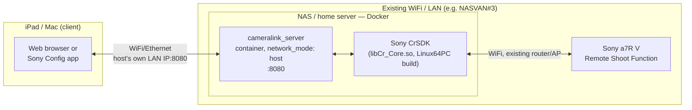

# Architecture

## System diagram

- **iPad/Mac ↔ Pi, over USB.** The Pi presents itself as a USB Ethernet
  device (`g_ether`) when its USB port is plugged into the iPad or a Mac.
  This is also how the Pi gets its power in the field — one cable does both.
  This link is **static-addressed, no DHCP** — see
  [below](#why-usb-is-static-not-dhcp) for why that one specifically matters.
- **Pi ↔ camera, over WiFi.** The Pi runs its *own* access point; the
  camera joins it directly. No home network, no router, no internet
  connection required anywhere in this chain — the whole rig works
  standalone, anywhere.

## Second topology: Docker on an existing LAN (NAS / home server)

The same `cameralink_server` binary also runs as a container on any
x86_64 Linux box that's already on the same network as the camera — no
Pi, no dedicated access point, no USB gadget mode. Confirmed running on a
Synology NAS's Container Manager against a real a7R V. Full walkthrough:
[DOCKER.md](DOCKER.md).

The key difference from the Pi topology: here the container and the
camera are both *joining* a network that already exists (your router's
Wi-Fi), rather than the Pi *being* the network. That trades away the
Pi kit's "works anywhere, no infrastructure" property for the
convenience of reusing hardware you already run 24/7 — a reasonable
trade for a home/studio setup that never leaves the house, less so for
a field kit. `network_mode: host` is what makes the container reachable
at the NAS's own address with no port-mapping to think about, the same
way the Pi's server is just reachable at whatever address the Pi itself
has.

## Why a Raspberry Pi Zero 2 W

The obvious first approach — a native macOS app calling Sony's CrSDK
directly — doesn't work reliably. macOS runs a system daemon
(`ptpcamerad`) that aggressively claims any PTP-class USB camera for
Photos/Image Capture the moment it's plugged in, and it respawns within
milliseconds of being killed. This isn't a corner case bug — it's a
documented, long-standing conflict between macOS and *any* third-party
camera-tethering software, including Sony's own official Imaging Edge
Desktop.

Sony's CrSDK ships an official Linux build, and Linux has no equivalent
daemon fighting for the USB interface. A Raspberry Pi is small, cheap,
runs that Linux build natively, and — critically for a Zero 2 W
specifically — its USB controller (`dwc2`) supports **USB gadget mode**:
it can present itself as a device (a USB Ethernet adapter) rather than a
host, which is exactly what's needed to be powered by *and* controlled
from an iPad over a single cable, no adapter, no separate battery.

The Zero 2 W's single radio can't do USB-host and Wi-Fi-client duty at the
same time in the way this project needs anyway — but that turns out not to
matter, because the camera doesn't connect over USB at all in this
architecture. It connects over the Pi's own Wi-Fi access point. USB is
reserved entirely for the iPad link.

## Why USB is static, not DHCP

The `usb0` interface (the Pi's side of the Mac/iPad USB link) is
configured with a fixed static IP instead of DHCP, and this one is load-
bearing, not a preference. Early on, `usb0` was left on its default
DHCP-seeking configuration, and the interface repeatedly went flaky —
dropping for a minute or more at a time, sometimes needing a physical
unplug/replug to recover. Root cause: `usb0` was endlessly retrying a
DHCP lease over a link where nothing on the Mac/iPad side serves DHCP —
a documented cause of exactly this kind of intermittent USB gadget
flakiness. The fix was static IPs on both ends of that link (`192.168.7.2`
on the Pi, `192.168.7.1` on the host — see [BUILDING.md](BUILDING.md) and
`scripts/setup-pi.sh`), confirmed via a 5-minute/30-check automated
stability test with zero drops afterward.

**This does not apply to the Wi-Fi access point.** The AP runs a normal
DHCP server (`10.42.0.10`–`10.42.0.254`) — it was briefly configured
without one, on the reasoning that cameralink already treats the camera's
IP as a value you provide when connecting, so a dynamic address seemed
unnecessary. That turned out to be short-sighted: it assumed every camera
supports manual/static IP entry over Wi-Fi, which not all of them do.
DHCP on the AP was never actually
implicated in the `usb0` stability bug above — they're different network
interfaces entirely — so there was no real reason to remove it, and it's
been reinstated. A camera that supports static IP entry (see
[CAMERA_SETUP.md](CAMERA_SETUP.md)) can still use one if you want a
predictable address; one that doesn't can just take whatever the AP
hands out.

## API-first design

`server/main.cpp` exposes a plain JSON REST API
(`/api/status`, `/api/connect/usb`, `/api/connect/network`, `/api/recipe`,
`/api/presets`, `/api/disconnect`); `server/public/index.html` is just one
client of it, calling the same endpoints with `fetch()`. A future native
iPad app would be a second client of the identical API — the backend
doesn't need to change to support that.

## A note on macOS

An earlier phase of this project built a native macOS app calling CrSDK
directly, before the `ptpcamerad` conflict above made that path
unreliable enough to abandon in favor of the Pi. That code isn't part of
this repo (see [README.md](../README.md) for scope), but the finding is
worth recording here since it's the reason this project exists in its
current shape.
